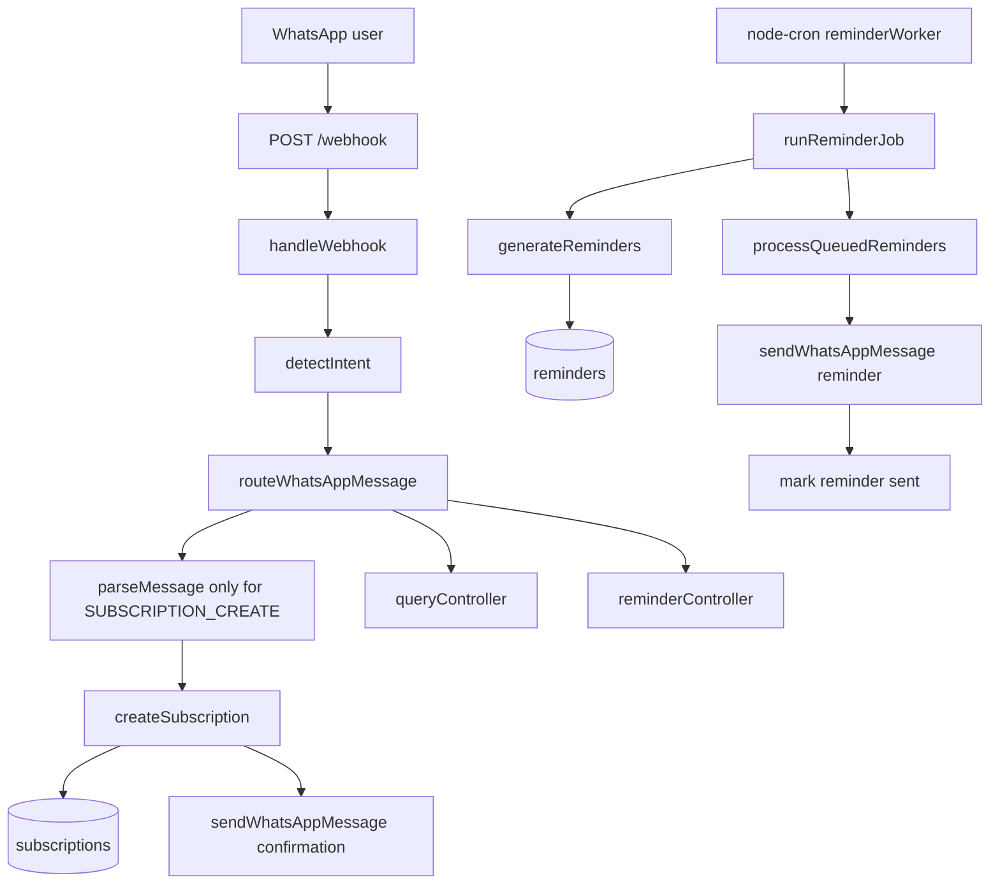

# Koshya MVP Flow



## Flow inventory

| Step | File | Function | Route/Cron | Dependencies | Tables |
| --- | --- | --- | --- | --- | --- |
| Webhook entry | `routes/webhookRoutes.js` | router | `POST /webhook` | Express | none |
| Webhook controller | `controllers/webhookController.js` | `handleWebhook` | `POST /webhook` | Supabase, `routeWhatsAppMessage` | `messages` |
| Intent detection | `src/services/intentService.js` | `detectIntent` | Before all WhatsApp text routing | Rule-based intent patterns | none |
| Intent router | `src/services/messageRouterService.js` | `routeWhatsAppMessage` | Webhook text flow | Intent service, query/reminder/subscription handlers | depends on intent |
| Parser | `services/parserService.js` | `parseMessage` | Webhook and `POST /api/parse` | Regex parser helpers | none |
| API parser wrapper | `src/services/parserService.js` | `parseSubscriptionMessage` | `POST /api/parse` | Existing parser, `ApiError` | none |
| Subscription flow | `services/subscriptionFlowService.js` | `handleSubscriptionMessage`, `saveAndReply` | Webhook | Parser, pending state, WhatsApp sender | `messages`, `subscriptions` |
| Subscription API | `src/controllers/subscriptionController.js` | `createSubscription`, `listUserSubscriptions`, `getSubscription`, `editSubscription`, `removeSubscription` | `/api/subscriptions` | `src/services/subscriptionService.js` | `subscriptions` |
| Subscription storage | `src/services/subscriptionService.js` | `createSubscriptionFromMessage`, `getUserSubscriptions`, `updateSubscription`, `deleteSubscription` | `/api/subscriptions` | Supabase, parser wrapper | `subscriptions` |
| Reminder generation | `src/services/reminderService.js` | `generateReminders`, `computeReminderRenewalDate` | `POST /api/reminders/generate`, cron | Supabase | `subscriptions`, `reminders` |
| Reminder API | `src/controllers/reminderController.js` | `generate`, `pending`, `sent` | `/api/reminders` | `src/services/reminderService.js` | `reminders` |
| Reminder cron | `services/reminderWorker.js` | `runSafely` | `0 9,21 * * *` by default | `node-cron`, `runReminderJob` | none |
| Reminder job | `services/reminderJobService.js` | `runReminderJob`, `processQueuedReminders` | Startup catch-up and cron | Supabase, reminder generation, WhatsApp sender | `subscriptions`, `reminders` |
| WhatsApp delivery | `services/whatsappService.js` | `sendWhatsAppMessage` | Webhook replies and reminder job | Gupshup WhatsApp API | none |

## Intent routing impact

WhatsApp text messages now run through `intentService.detectIntent()` before parser execution. Only `SUBSCRIPTION_CREATE` reaches `services/subscriptionFlowService.js`; reminder queries, reminder creation, subscription queries, updates, help, and unknown messages are handled before the subscription parser can create drafts or records.

Bug guardrails:

- `Netflix renewal tomorrow` routes to `REMINDER_QUERY`.
- `Tell me about an existing Netflix reminder` routes to `REMINDER_QUERY`.
- `What renews tomorrow?` routes to `REMINDER_QUERY`.

## API documentation

### Parse message

`POST /api/parse`

```sh
curl -X POST "$BASE_URL/api/parse" \
  -H 'Content-Type: application/json' \
  -d '{"message":"Netflix renews on 27th every month - 149"}'
```

### Create subscription

`POST /api/subscriptions`

```sh
curl -X POST "$BASE_URL/api/subscriptions" \
  -H 'Content-Type: application/json' \
  -d '{"userPhone":"919999999999","message":"Netflix renews on 27th every month - 149"}'
```

### Get user subscriptions

`GET /api/subscriptions/:phone`

```sh
curl "$BASE_URL/api/subscriptions/919999999999"
```

### Get single subscription

`GET /api/subscriptions/id/:id`

```sh
curl "$BASE_URL/api/subscriptions/id/<subscription-id>"
```

### Update subscription

`PUT /api/subscriptions/:id`

```sh
curl -X PUT "$BASE_URL/api/subscriptions/<subscription-id>" \
  -H 'Content-Type: application/json' \
  -d '{"amount":199,"renewalDay":28}'
```

### Delete subscription

`DELETE /api/subscriptions/:id`

```sh
curl -X DELETE "$BASE_URL/api/subscriptions/<subscription-id>"
```

### Generate reminders

`POST /api/reminders/generate`

```sh
curl -X POST "$BASE_URL/api/reminders/generate" \
  -H 'Content-Type: application/json' \
  -d '{"daysAhead":1,"catchUpDays":7}'
```

### Get pending reminders

`GET /api/reminders/pending`

```sh
curl "$BASE_URL/api/reminders/pending"
```

### Mark reminder sent

`POST /api/reminders/:id/sent`

```sh
curl -X POST "$BASE_URL/api/reminders/<reminder-id>/sent"
```
